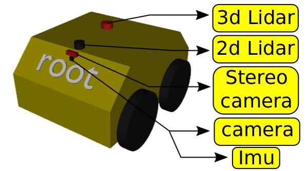
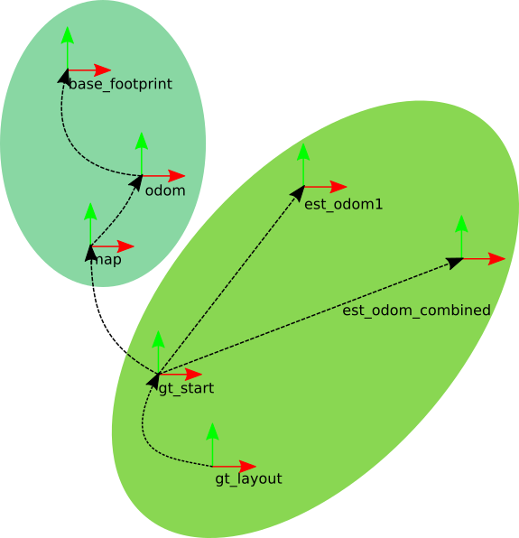
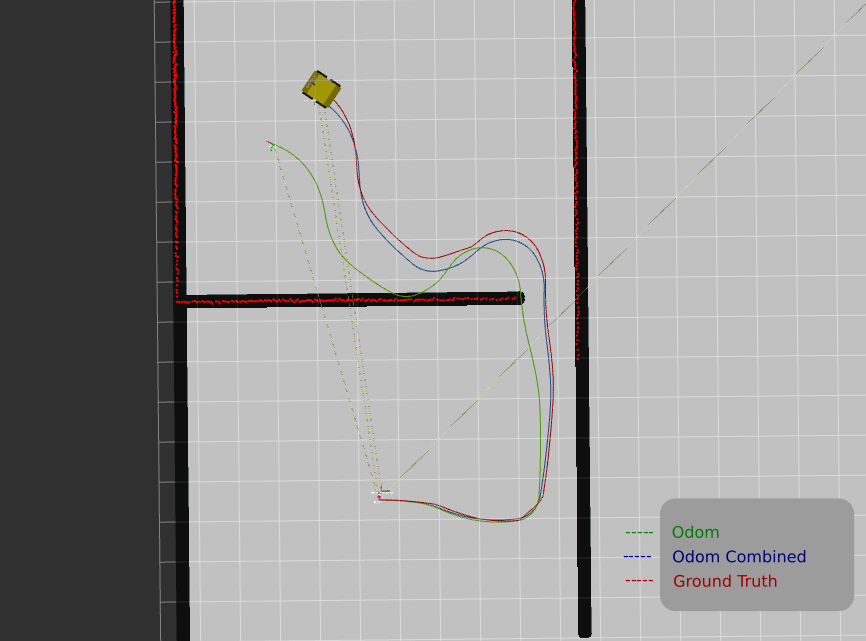

# root

- Root is an open-source indoor simulated robot.
- It is built with the intention to test different algorithms related to:
	- Motion planning
	- Dynamics and Control
	- Perception
	- State estimation
- It contains a varity of commonly used sensor that can be easily enabled and disabled as per the requirement.
- With root, there comes root_home and its friends as workspace for it to operate in:
  
  1. root_home  
     
  
  2. root_home_realistic  
    

## Ground truth
- When comparing different state estimation algorithms (eg, sensor fusion of different odometry source, localization with a known map, simultaneous localization and mapping(SLAM) etc) ground truth information becomes very helpful.

- So for this purpos:
  1. ground truth layout has been made from the cad file of root_home  
     
  2. gt_pub node has beed made which publishes different ground truth informations:
      
      * Transforms  
    
      
      * Paths  
    
