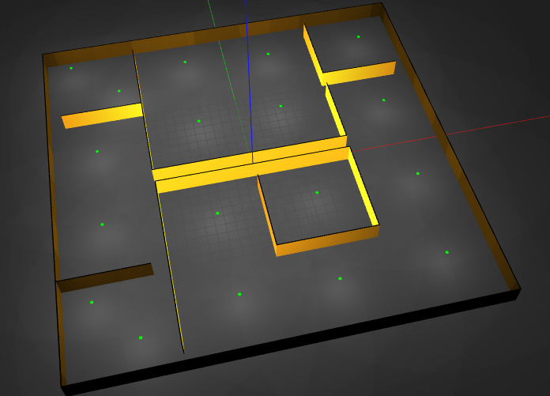
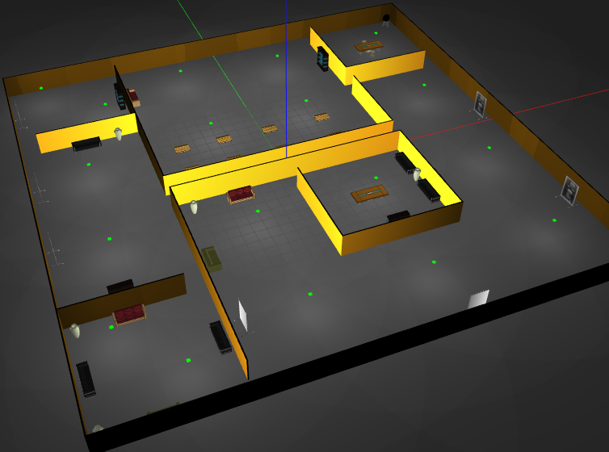

# root
 

- Root is an open-source indoor simulated robot.
- It is built with the intention to test different algorithms related to:
	- Motion planning
	- Dynamics and Control
	- Perception
	- State estimation
- It contains a varity of commonly used sensor that can be easily enabled and disabled as per the requirement.
- With root, there comes root_home and its friends as workspace for it to operate in:
 	1. root_home
 		-  
	2. root_home_realistic
		- 

## Ground truth
- When comparing different state estimation algorithm (eg, sensor fusion of different odometry source, localization with a known map, simultaneous localization and mapping(SLAM) etc) ground truth information becomes very helpful.

- So for this purpos:
	1. ground truth layout has been made from the cad file of root_home
		- 
	2. gt_pub node has beed made which publishes different ground truth information.
		- 
		- Example:
			- 
## Reated package stacks
1. [root_bringup](https://github.com/root-org/root_bringup)
2. [root_state_estimation](https://github.com/root-org/root_state_estimation)
3. [root_navigation](https://github.com/root-org/root_navigation)
