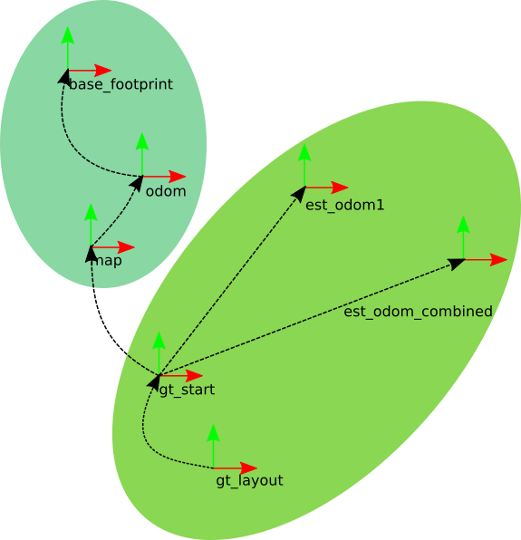

# root_gazebo
## Package Summary
This package contains world, relevent models and plugins needed to simulate root in gazebo.
## Nodes

### 1. gt_pub

#### Subscribed Topics
1. odom ([nav_msgs/Odometry](http://docs.ros.org/en/melodic/api/nav_msgs/html/msg/Odometry.html))
2. odom_combined ([geometry_msgs/PoseWithCovarianceStamped](http://docs.ros.org/en/melodic/api/geometry_msgs/html/msg/PoseWithCovarianceStamped.html))
3. gazebo/link_states ([gazebo_msgs/LinkStates](http://docs.ros.org/en/jade/api/gazebo_msgs/html/msg/LinkStates.html))

#### Published Topics
1. tf ([geometry_msgs/TransformStamped](http://docs.ros.org/en/api/geometry_msgs/html/msg/TransformStamped.html))
2. tf_static ([geometry_msgs/TransformStamped](http://docs.ros.org/en/api/geometry_msgs/html/msg/TransformStamped.html))
3. est_odom_path ([nav_msgs::Path](http://docs.ros.org/en/melodic/api/nav_msgs/html/msg/Path.html))
4. est_odom_combined_path ([nav_msgs::Path](http://docs.ros.org/en/melodic/api/nav_msgs/html/msg/Path.html))

  

#### Params
```YAML
~robot: "root"
~base_footprint: "base_footprint"
~tf_tree_root: "map"
~layout: "gt_layout"
~source_topic: ["odom", "odom_combined"]
~source_type: ["nav_msgs/Odometry", "geometry_msgs/PoseWithCovarianceStamped"]
~frame_name: ["est_odom", "est_odom_combined"]
~publish_tf: ["true", "true"]
~publish_path: ["true", "true"]
~publish_gt_path: "true"
~path_resolution: 0.01
```
## CAD Files
1. [root_home_walls](https://cad.onshape.com/documents/1ba97690d0a1c133704d4455/w/76f740754467ef4f6a9192e8/e/b97d474cf5a4f5ae60470df4)
